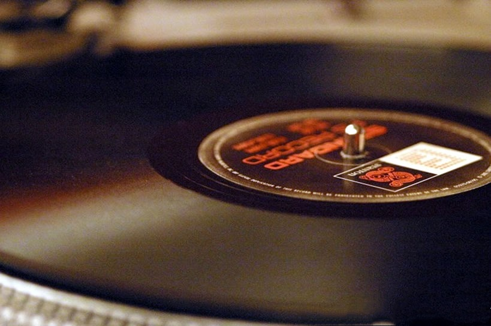

<h1 id="EDA: el formato del vinilo a lo largo de los siglos"> :musical_score: EDA: el formato del vinilo a lo largo de los siglos</h1>

La industria musical ha sido testigo, a lo largo de los años, de diversos cambios en el formato de sus productos. Pero el formato que siempre parece permanecer inquebrantable es el vinilo. Desde su primera aparición, a mediados de la década de los años 50 del siglo pasado, es un formato apreciado y románticamente casi considerado como de culto.

Para los amantes de la música, siempre ha estado más o menos clara la elección, pero veamos si somos capaces de analizar a partir de los datos de lanzamiento de productos musicales en diversos formatos a lo largo de más de un siglo, si es cierto que independientemente de las modas y de la aparición de otros formatos, el vinilo no ha dejado de producirse ni de comprarse. Y para ello nos vamos a servir de un Análisis Exploratorio de Datos (o EDA, por sus siglas en inglés) usando Python.

<h2 id="Fuente de los datos"> :bar_chart: Fuente de los datos</h2>

La plataforma *DISCOGS* alberga información y bases de datos acerca de la música, e intenta recopilar toda la información acerca de los discos comerciales, promocionales, y discos no oficiales, tal y como ellos mismos se definen. Precisamente de esta plataforma, hemos obtenido una riquísima base de datos, con más de 17 millones de registros, sobre todos los discos publicados desde 1860 en adelante, en función de su año de publicación, país, género y formato.

<h3 id="Desarrollo del trabajo de análisis"> :detective: Desarrollo del trabajo de análisis</h3>

+ En primer lugar, hemos llevado a cabo una limpieza de los datos, en cuanto a valores faltantes, valores con comas o espacios en blanco, y convirtiendo los tipos de datos allá donde fuera necesario a fin de poder analizarlos correctamente.

+ A continuación, hemos agrupado los datos en función de lo que queríamos estudiar comparándolos entre sí y aplicando diversos métodos de correlación y comparación.

+ Por último, hemos implementado las gráficas necesarias para una visualización óptima del análisis.

Dada la enorme cantidad de registros que tenía esta base de datos, y teniendo en cuenta los fines de este EDA, se decidió limitar el estudio a los 5 países con mayor producción musical, los 5 estilos musicales más producidos y los 5 formatos más utilizados. De esta forma, analizamos los datos desde un punto de vista más macro hasta nuestro objetivo, que es confirmar la hipótesis de un formato en particular.

<h2 id="Conclusiones"> :printer: Conclusiones</h2>

Después de bucear por los datos y sacar la foto en algunos de los aspectos más generales, nos centramos en el formato de nuestra hipótesis y vemos claramente que, a pesar de que los diversos formatos fluctúan sea por modas o por variaciones en su aparición y descubrimiento, el vinilo se mantiene a lo largo del tiempo entre los formatos más publicados. Por lo que podríamos decir que **nuestra hipótesis queda confirmada tras analizar los datos**.

_____________________________________________

<h1 id="EDA: Vinyl Format Across Centuries"> :musical_score: EDA: Vinyl Format Across Centuries</h1>

The music industry has witnessed various changes in the format of its products over the years. However, the format that always seems to remain unshakable is vinyl. Since its inception in the mid-1950s, it's been cherished and romantically regarded almost as a cult favorite.

For music enthusiasts, the choice has always been more or less clear, but let's see if we can analyze, based on the release data of musical products in various formats over more than a century, whether it's true that regardless of trends and the emergence of other formats, vinyl has continued to be produced and purchased. To do this, we will employ an Exploratory Data Analysis (EDA) using Python.

<h2 id="Data Source"> :bar_chart: Data Source</h2>

The *DISCOGS* platform hosts information and databases about music, aiming to gather all information about commercial, promotional, and unofficial records, as they define themselves. Precisely from this platform, we have obtained a rich database with over 17 million records of all discs published from 1860 onwards, categorized by their release year, country, genre, and format.

<h3 id="Analysis Workflow"> :detective: Analysis Workflow</h3>

+ Firstly, we performed data cleaning, handling missing values, dealing with commas or white spaces, and converting data types as needed for proper analysis.

+ Next, we grouped the data based on what we wanted to study, comparing them to each other and applying various correlation and comparison methods.

+ Lastly, we implemented the necessary graphs for optimal visualization of the analysis.

Given the vast number of records in this database, and considering the purposes of this EDA, we decided to narrow the study down to the top 5 countries with the highest musical production, the top 5 most produced music styles, and the top 5 most used formats. Thus, we analyze the data from a more macro perspective down to our goal, which is confirming a particular hypothesis.

<h2 id="Conclusions"> :printer: Conclusions</h2>

After delving into the data and capturing the overview of some of the most general aspects, we focused on our hypothesis's format. It's clear that despite various formats fluctuating due to trends or variations in their emergence and discovery, vinyl has remained one of the most published formats over time. Thus, we could say that **our hypothesis is confirmed after analyzing the data**.
